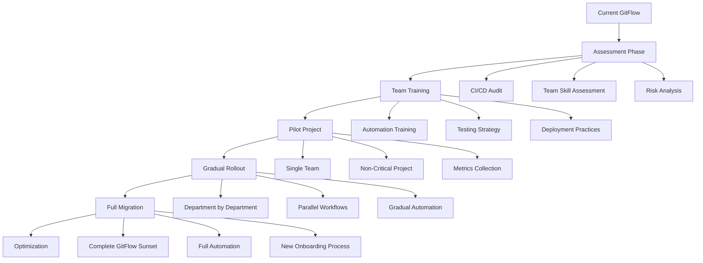
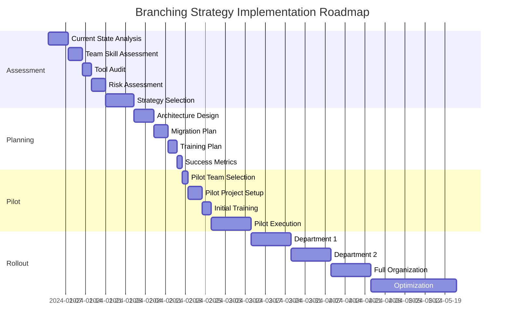

# Advanced Git Branching Strategies - Part 1: Architecture & Theory
*Deep Dive into Enterprise-Grade Branching Models*

---

## 🏛️ **Introduction: The Strategic Layer of Version Control**

For experienced architects and senior engineers, branching strategies are not just workflows—they're architectural decisions that impact team velocity, system reliability, deployment frequency, and organizational scalability. This guide provides the deep analysis needed for strategic decision-making.

### The Real Cost of Branching Decisions

**Poor branching strategy impacts:**
- **Development Velocity**: 30-50% productivity loss from merge conflicts and coordination overhead
- **Deployment Frequency**: Can reduce from daily to monthly deployments
- **System Reliability**: Increases production incidents by 200-400%
- **Team Scalability**: Limits effective team size to 5-8 developers
- **Technical Debt**: Creates long-lived branches that accumulate conflicts

**Enterprise Metrics:**
- **GitFlow**: Average 2-4 deployments per month, 45-90 minute merge overhead per feature
- **GitHub Flow**: Average 10-50 deployments per day, 5-15 minute integration overhead
- **GitLab Flow**: Average 2-10 deployments per week, 15-30 minute promotion overhead

---

## 🎯 **Strategic Framework: Branching Strategy Selection Matrix**

### Multi-Dimensional Analysis Framework

```
Strategy Selection Criteria:

┌─────────────────┬──────────────┬───────────────┬─────────────────┐
│ Dimension       │ GitFlow      │ GitHub Flow   │ GitLab Flow     │
├─────────────────┼──────────────┼───────────────┼─────────────────┤
│ Team Size       │ 20-500+      │ 3-50          │ 10-200          │
│ Deploy Freq     │ Monthly      │ Daily/Hourly  │ Weekly          │
│ Complexity      │ High         │ Low           │ Medium          │
│ Risk Tolerance  │ Low          │ High          │ Medium          │
│ Compliance      │ Strict       │ Minimal       │ Moderate        │
│ Automation Req  │ Moderate     │ High          │ High            │
│ Learning Curve  │ Steep        │ Gentle        │ Moderate        │
│ Merge Overhead  │ High         │ Low           │ Medium          │
└─────────────────┴──────────────┴───────────────┴─────────────────┘
```

### Architecture Decision Records (ADR) Template

```markdown
# ADR-001: Branching Strategy Selection

## Status: [DRAFT/ACCEPTED/SUPERSEDED]

## Context
- Team size: [X] developers across [Y] teams
- Deployment frequency requirement: [daily/weekly/monthly]
- Compliance requirements: [SOX/HIPAA/ISO27001/etc]
- Risk tolerance: [low/medium/high]
- Current CI/CD maturity: [manual/semi-automated/fully automated]

## Decision
Adopting [GitFlow/GitHub Flow/GitLab Flow] based on:

## Consequences
- Positive: [list benefits]
- Negative: [list trade-offs]
- Risks: [identified risks and mitigations]
```

---

## 🌊 **GitFlow: The Enterprise Architecture**

### Architectural Principles

GitFlow implements **separation of concerns** at the branching level:
- **Parallel Development**: Multiple features develop independently
- **Integration Testing**: Develop branch serves as integration layer
- **Release Hardening**: Release branches provide stabilization period
- **Production Isolation**: Main branch remains pristine

### Detailed Architecture Diagram

```
GitFlow Architecture - Information Flow and Responsibility Matrix

                    ┌─────────────────────────────────┐
                    │         MAIN BRANCH             │
                    │    (Production Releases)        │
                    │  ┌─────┐ ┌─────┐ ┌─────┐       │
                    │  │v1.0 │ │v1.1 │ │v2.0 │       │
                    │  └─────┘ └─────┘ └─────┘       │
                    └─────────────▲───────────────────┘
                                  │
                    ┌─────────────┼───────────────────┐
                    │        HOTFIX/*               │
                    │    (Emergency Fixes)          │
                    │                               │
                    │  ┌─────────────────────────┐  │
                    │  │  Critical Bug Fixes     │  │
                    │  │  Security Patches       │  │
                    │  │  Data Corruption Fixes  │  │
                    │  └─────────────────────────┘  │
                    └─────────────────────────────────┘
                                  │
    ┌─────────────────────────────┼─────────────────────────────┐
    │                    DEVELOP BRANCH                         │
    │              (Integration & Staging)                      │
    │                                                          │
    │  ┌─────────────┐  ┌─────────────┐  ┌─────────────┐      │
    │  │   CI/CD     │  │Integration  │  │Performance  │      │
    │  │   Testing   │  │   Testing   │  │  Testing    │      │
    │  └─────────────┘  └─────────────┘  └─────────────┘      │
    └─────────────────────▲───────────────────────────────────┘
                          │
    ┌─────────────────────┼───────────────────────────────────┐
    │               RELEASE/*                                 │
    │          (Pre-Production Hardening)                     │
    │                                                        │
    │  ┌─────────────┐  ┌─────────────┐  ┌─────────────┐    │
    │  │    UAT      │  │Performance  │  │  Security   │    │
    │  │  Testing    │  │  Testing    │  │  Testing    │    │
    │  └─────────────┘  └─────────────┘  └─────────────┘    │
    └─────────────────────▲───────────────────────────────────┘
                          │
    ┌─────────────────────┼───────────────────────────────────┐
    │                FEATURE/*                               │
    │            (Parallel Development)                      │
    │                                                        │
    │ ┌─────────────┐ ┌─────────────┐ ┌─────────────┐       │
    │ │   Feature   │ │   Feature   │ │   Feature   │       │
    │ │      A      │ │      B      │ │      C      │       │
    │ │             │ │             │ │             │       │
    │ │ ┌─────────┐ │ │ ┌─────────┐ │ │ ┌─────────┐ │       │
    │ │ │Unit Test│ │ │ │Unit Test│ │ │ │Unit Test│ │       │
    │ │ │Coverage │ │ │ │Coverage │ │ │ │Coverage │ │       │
    │ │ └─────────┘ │ │ └─────────┘ │ │ └─────────┘ │       │
    │ └─────────────┘ └─────────────┘ └─────────────┘       │
    └─────────────────────────────────────────────────────────┘
```

### Critical Success Factors for GitFlow

#### 1. **Branch Lifecycle Management**
```bash
# Feature branch lifecycle (typical 1-4 weeks)
┌─────────────────┬─────────────────┬─────────────────┐
│ Phase           │ Duration        │ Gate Criteria   │
├─────────────────┼─────────────────┼─────────────────┤
│ Development     │ 1-3 weeks       │ Feature complete│
│ Code Review     │ 1-3 days        │ 2+ approvals    │
│ Integration     │ 1-2 days        │ CI/CD passes    │
│ Merge to Dev    │ Immediate       │ Conflicts resolved│
└─────────────────┴─────────────────┴─────────────────┘

# Release branch lifecycle (typical 1-2 weeks)
┌─────────────────┬─────────────────┬─────────────────┐
│ Phase           │ Duration        │ Gate Criteria   │
├─────────────────┼─────────────────┼─────────────────┤
│ Branch Creation │ 1 day           │ Feature freeze  │
│ Stabilization   │ 3-7 days        │ Bug fixes only  │
│ Testing         │ 3-5 days        │ QA signoff      │
│ Release         │ 1 day           │ Production deploy│
└─────────────────┴─────────────────┴─────────────────┘
```

#### 2. **Merge Strategy Analysis**
```bash
# Recommended merge strategies by branch type
Feature → Develop:     --no-ff (preserve feature context)
Release → Main:        --no-ff (preserve release boundary)  
Release → Develop:     --ff-only (clean integration)
Hotfix → Main:         --no-ff (emergency traceability)
Hotfix → Develop:      --ff-only (immediate integration)
```

#### 3. **Quality Gate Architecture**
```yaml
# Enterprise GitFlow Quality Gates
quality_gates:
  feature_branch:
    - unit_tests: 85% coverage minimum
    - static_analysis: no critical issues
    - security_scan: no high/critical vulnerabilities
    - code_review: 2+ senior engineer approvals
    
  develop_branch:
    - integration_tests: all passing
    - performance_tests: no regression
    - dependency_scan: no known vulnerabilities
    - smoke_tests: core functionality verified
    
  release_branch:
    - user_acceptance_testing: complete signoff
    - load_testing: performance benchmarks met
    - security_testing: penetration test passed
    - documentation: release notes complete
    
  main_branch:
    - production_deployment: automated rollback capability
    - monitoring: health checks configured
    - rollback_plan: documented and tested
```

### GitFlow Anti-Patterns and Mitigation Strategies

#### Common Anti-Patterns:
1. **Long-lived feature branches** (>2 weeks)
   - **Risk**: Massive merge conflicts, integration hell
   - **Mitigation**: Feature flagging, smaller feature scope

2. **Direct commits to develop**
   - **Risk**: Bypassing code review, breaking CI
   - **Mitigation**: Branch protection rules, automated enforcement

3. **Skipping release branches**
   - **Risk**: Insufficient testing, production bugs
   - **Mitigation**: Mandatory release process, automated branch creation

4. **Incomplete hotfix propagation**
   - **Risk**: Develop branch missing critical fixes
   - **Mitigation**: Automated hotfix propagation, verification scripts

### Enterprise GitFlow Implementation Pattern

```bash
# Enterprise GitFlow Setup with Automation
#!/bin/bash

# 1. Repository initialization with enterprise standards
git flow init --defaults
git config --local gitflow.branch.master main
git config --local gitflow.prefix.feature feature/
git config --local gitflow.prefix.release release/
git config --local gitflow.prefix.hotfix hotfix/

# 2. Hook-based quality enforcement
cat > .git/hooks/pre-commit << 'EOF'
#!/bin/bash
# Enforce branch naming conventions
branch=$(git symbolic-ref HEAD | sed -e 's,.*/\(.*\),\1,')

# Validate branch naming
if [[ $branch =~ ^(feature|release|hotfix)/.+ ]]; then
    exit 0
elif [[ $branch == "develop" || $branch == "main" ]]; then
    echo "Direct commits to $branch not allowed"
    exit 1
fi
EOF

# 3. Automated branch protection
gh api repos/$REPO/branches/main/protection \
  --method PUT \
  --field required_status_checks='{"strict":true,"contexts":["ci","security","quality"]}' \
  --field enforce_admins=true \
  --field required_pull_request_reviews='{"required_approving_review_count":2,"dismiss_stale_reviews":true}'
```

---

## 🚀 **GitHub Flow: The Continuous Deployment Architecture**

### Architectural Principles

GitHub Flow implements **continuous integration** with **deployment-driven development**:
- **Single Source of Truth**: Main branch as the definitive state
- **Feature Isolation**: Each feature is independently deployable
- **Immediate Feedback**: Fast feedback loops through automation
- **Deployment Confidence**: Every commit is potentially shippable

### Detailed Architecture Diagram

```
GitHub Flow Architecture - Continuous Deployment Pipeline

                    ┌─────────────────────────────────────────┐
                    │            MAIN BRANCH                  │
                    │        (Always Deployable)             │
                    │                                         │
                    │  ┌─────┐ ┌─────┐ ┌─────┐ ┌─────┐      │
                    │  │ c1  │→│ c2  │→│ c3  │→│ c4  │      │
                    │  └─────┘ └─────┘ └─────┘ └─────┘      │
                    │     │       │       │       │         │
                    │     ▼       ▼       ▼       ▼         │
                    │  ┌─────────────────────────────────┐   │
                    │  │    AUTO-DEPLOY PIPELINE       │   │
                    │  │                               │   │
                    │  │ Test → Build → Deploy →      │   │
                    │  │         Verify → Monitor      │   │
                    │  └─────────────────────────────────┘   │
                    └─────────────────────────────────────────┘
                                      ▲
                    ┌─────────────────┼─────────────────────┐
                    │           PULL REQUESTS             │
                    │        (Quality Gates)              │
                    │                                     │
                    │ ┌─────────────┐ ┌─────────────┐     │
                    │ │   Branch    │ │   Status    │     │
                    │ │ Protection  │ │   Checks    │     │
                    │ │             │ │             │     │
                    │ │ • Reviews   │ │ • CI Tests  │     │
                    │ │ • Approvals │ │ • Security  │     │
                    │ │ • Policies  │ │ • Coverage  │     │
                    │ └─────────────┘ └─────────────┘     │
                    └─────────────────┼─────────────────────┘
                                      ▲
    ┌─────────────────────────────────┼───────────────────────────────┐
    │                        FEATURE BRANCHES                         │
    │                    (Short-lived, Focused)                       │
    │                                                                 │
    │ ┌─────────────┐ ┌─────────────┐ ┌─────────────┐ ┌─────────────┐ │
    │ │   Feature   │ │   Feature   │ │   Hotfix    │ │ Improvement │ │
    │ │      A      │ │      B      │ │             │ │             │ │
    │ │             │ │             │ │             │ │             │ │
    │ │ ┌─────────┐ │ │ ┌─────────┐ │ │ ┌─────────┐ │ │ ┌─────────┐ │ │
    │ │ │Real-time│ │ │ │Real-time│ │ │ │Critical │ │ │ │Real-time│ │ │
    │ │ │  Tests  │ │ │ │  Tests  │ │ │ │  Fix    │ │ │ │  Tests  │ │ │
    │ │ └─────────┘ │ │ └─────────┘ │ │ └─────────┘ │ │ └─────────┘ │ │
    │ │             │ │             │ │             │ │             │ │
    │ │ ┌─────────┐ │ │ ┌─────────┐ │ │ ┌─────────┐ │ │ ┌─────────┐ │ │
    │ │ │Preview  │ │ │ │Preview  │ │ │ │Emergency│ │ │ │Preview  │ │ │
    │ │ │ Deploy  │ │ │ │ Deploy  │ │ │ │ Deploy  │ │ │ │ Deploy  │ │ │
    │ │ └─────────┘ │ │ └─────────┘ │ │ └─────────┘ │ │ └─────────┘ │ │
    │ └─────────────┘ └─────────────┘ └─────────────┘ └─────────────┘ │
    └─────────────────────────────────────────────────────────────────┘
```

### Critical Success Factors for GitHub Flow

#### 1. **Deployment Pipeline Architecture**
```yaml
# High-Performance CI/CD Pipeline
stages:
  pre_commit:
    duration: "<30 seconds"
    gates:
      - linting: eslint, prettier
      - unit_tests: jest (parallel execution)
      - security: secret scanning
      
  pull_request:
    duration: "<5 minutes"
    gates:
      - integration_tests: API contract tests
      - e2e_tests: critical path verification
      - security_scan: SAST + dependency check
      - performance: regression testing
      
  post_merge:
    duration: "<10 minutes"
    gates:
      - build: container image creation
      - staging_deploy: automated deployment
      - smoke_tests: health verification
      - production_deploy: blue/green deployment
      
  post_deploy:
    duration: "<5 minutes"
    gates:
      - health_check: application monitoring
      - rollback_ready: automatic failure detection
      - notification: team alerts
```

#### 2. **Feature Flag Architecture**
```javascript
// Progressive feature rollout strategy
const featureFlags = {
  // Canary deployment (1% of users)
  newCheckoutFlow: {
    enabled: true,
    rollout: {
      percentage: 1,
      criteria: ['internal_users', 'beta_testers']
    }
  },
  
  // A/B testing (50/50 split)
  improvedSearch: {
    enabled: true,
    rollout: {
      percentage: 50,
      criteria: ['randomized_user_id']
    }
  },
  
  // Gradual rollout (10% daily increase)
  newDashboard: {
    enabled: true,
    rollout: {
      percentage: 10,
      increment: 10, // daily
      criteria: ['user_tier', 'geographic_region']
    }
  }
};
```

#### 3. **Observability and Monitoring Stack**
```yaml
# Comprehensive monitoring for GitHub Flow
observability:
  metrics:
    deployment_frequency: "deployments per day"
    lead_time: "commit to production time"
    mttr: "mean time to recovery"
    change_failure_rate: "percentage of failed deployments"
    
  alerts:
    high_priority:
      - error_rate: ">1% for 2 minutes"
      - response_time: ">500ms p95 for 5 minutes"
      - deployment_failure: "immediate"
      
    medium_priority:
      - test_coverage: "<80%"
      - security_vulnerabilities: "new high/critical"
      - performance_regression: ">10% degradation"
      
  dashboards:
    engineering:
      - deployment_pipeline_health
      - feature_flag_status
      - code_quality_trends
      
    business:
      - feature_adoption_rates
      - user_impact_metrics
      - revenue_impact_tracking
```

### GitHub Flow Anti-Patterns and Solutions

#### Common Anti-Patterns:
1. **Feature branches lasting >3 days**
   - **Risk**: Integration conflicts, delayed feedback
   - **Solution**: Feature flagging, trunk-based development

2. **Manual testing dependencies**
   - **Risk**: Deployment bottlenecks, inconsistent quality
   - **Solution**: Test automation, shift-left testing

3. **Monolithic deployments**
   - **Risk**: Large blast radius, difficult rollbacks
   - **Solution**: Microservices, independent deployments

4. **Insufficient monitoring**
   - **Risk**: Silent failures, customer impact
   - **Solution**: Comprehensive observability, proactive alerting

---

## 🏗️ **GitLab Flow: The Environment Management Architecture**

### Architectural Principles

GitLab Flow implements **environment progression** with **controlled promotion**:
- **Environment Parity**: Consistent configuration across environments
- **Progressive Deployment**: Staged rollout with validation gates
- **Approval Workflows**: Human oversight for critical promotions
- **Compliance Integration**: Audit trails and governance controls

### Detailed Architecture Diagram

```
GitLab Flow Architecture - Environment Promotion Pipeline

                    ┌─────────────────────────────────────────┐
                    │          PRODUCTION BRANCH              │
                    │        (Live Customer Traffic)          │
                    │                                         │
                    │  ┌─────────────────────────────────┐    │
                    │  │      Production Environment    │    │
                    │  │                                │    │
                    │  │  • Load Balancers             │    │
                    │  │  • Auto Scaling               │    │
                    │  │  • Database Clusters          │    │
                    │  │  • CDN Distribution           │    │
                    │  │  • Monitoring & Alerting      │    │
                    │  └─────────────────────────────────┘    │
                    └─────────────────┼───────────────────────┘
                                      ▲
                    ┌─────────────────┼───────────────────────┐
                    │             APPROVAL GATE               │
                    │         (Manual Promotion)              │
                    │                                         │
                    │  ┌─────────────┐ ┌─────────────┐       │
                    │  │  Business   │ │ Operations  │       │
                    │  │  Signoff    │ │  Approval   │       │
                    │  └─────────────┘ └─────────────┘       │
                    └─────────────────┼───────────────────────┘
                                      ▲
                    ┌─────────────────┼───────────────────────┐
                    │        PRE-PRODUCTION BRANCH            │
                    │      (Production-like Testing)          │
                    │                                         │
                    │  ┌─────────────────────────────────┐    │
                    │  │   Pre-Production Environment   │    │
                    │  │                                │    │
                    │  │  • Production Data Subset     │    │
                    │  │  • Full Security Scanning     │    │
                    │  │  • Performance Testing        │    │
                    │  │  • User Acceptance Testing    │    │
                    │  │  • Compliance Validation      │    │
                    │  └─────────────────────────────────┘    │
                    └─────────────────┼───────────────────────┘
                                      ▲
                    ┌─────────────────┼───────────────────────┐
                    │        STAGING BRANCH                   │
                    │      (Integration Testing)              │
                    │                                         │
                    │  ┌─────────────────────────────────┐    │
                    │  │      Staging Environment       │    │
                    │  │                                │    │
                    │  │  • Feature Integration        │    │
                    │  │  • API Contract Testing       │    │
                    │  │  • Cross-service Testing      │    │
                    │  │  • Database Migrations        │    │
                    │  │  • Configuration Testing      │    │
                    │  └─────────────────────────────────┘    │
                    └─────────────────┼───────────────────────┘
                                      ▲
                    ┌─────────────────┼───────────────────────┐
                    │           MAIN BRANCH                   │
                    │        (Development Hub)                │
                    │                                         │
                    │  ┌─────────────┐ ┌─────────────┐       │
                    │  │   Feature   │ │   Feature   │       │
                    │  │ Integration │ │ Integration │       │
                    │  └─────────────┘ └─────────────┘       │
                    └─────────────────┼───────────────────────┘
                                      ▲
    ┌─────────────────────────────────┼───────────────────────────────┐
    │                      FEATURE BRANCHES                           │
    │                 (Parallel Development)                          │
    │                                                                 │
    │ ┌─────────────┐ ┌─────────────┐ ┌─────────────┐ ┌─────────────┐ │
    │ │   Feature   │ │   Feature   │ │   Feature   │ │   Hotfix    │ │
    │ │      A      │ │      B      │ │      C      │ │             │ │
    │ │             │ │             │ │             │ │             │ │
    │ │ ┌─────────┐ │ │ ┌─────────┐ │ │ ┌─────────┐ │ │ ┌─────────┐ │ │
    │ │ │Unit Test│ │ │ │Unit Test│ │ │ │Unit Test│ │ │ │Emergency│ │ │
    │ │ │ + Local │ │ │ │ + Local │ │ │ │ + Local │ │ │ │ Testing │ │ │
    │ │ │Validation│ │ │ │Validation│ │ │ │Validation│ │ │ └─────────┘ │ │
    │ │ └─────────┘ │ │ └─────────┘ │ │ └─────────┘ │ │             │ │
    │ └─────────────┘ └─────────────┘ └─────────────┘ └─────────────┘ │
    └─────────────────────────────────────────────────────────────────┘
```

### Environment Configuration Matrix

```yaml
# Environment-specific configuration architecture
environments:
  development:
    infrastructure:
      compute: "minimal (1 CPU, 2GB RAM)"
      database: "single instance, no replication"
      storage: "local filesystem"
      networking: "internal only"
    features:
      debug_mode: true
      feature_flags: "all enabled"
      logging_level: "debug"
      mock_external_services: true
    data:
      dataset: "synthetic test data"
      volume: "1000 records"
      refresh: "daily"
      
  staging:
    infrastructure:
      compute: "moderate (2 CPU, 4GB RAM)"
      database: "primary + read replica"
      storage: "network attached storage"
      networking: "VPN accessible"
    features:
      debug_mode: false
      feature_flags: "staging configuration"
      logging_level: "info"
      mock_external_services: false
    data:
      dataset: "anonymized production subset"
      volume: "100k records"
      refresh: "weekly"
      
  pre_production:
    infrastructure:
      compute: "production-like (4 CPU, 8GB RAM)"
      database: "clustered, automated backups"
      storage: "distributed storage"
      networking: "production network topology"
    features:
      debug_mode: false
      feature_flags: "production configuration"
      logging_level: "warn"
      mock_external_services: false
    data:
      dataset: "full production clone"
      volume: "production scale"
      refresh: "nightly"
      
  production:
    infrastructure:
      compute: "auto-scaling (2-16 CPU, 4-32GB RAM)"
      database: "multi-region, HA clustering"
      storage: "geo-replicated storage"
      networking: "global load balancing"
    features:
      debug_mode: false
      feature_flags: "gradual rollout configuration"
      logging_level: "error"
      mock_external_services: false
    data:
      dataset: "live customer data"
      volume: "full scale"
      refresh: "real-time"
```

---

## 🎯 **Strategic Decision Framework**

### Cost-Benefit Analysis Model

```python
# Branching Strategy ROI Calculator
def calculate_strategy_cost(strategy, team_size, deploy_freq, complexity):
    """
    Calculate total cost of ownership for branching strategy
    """
    base_costs = {
        'gitflow': {
            'setup_hours': 40,
            'training_hours_per_dev': 16,
            'merge_overhead_per_feature': 4,
            'release_overhead_hours': 24
        },
        'github_flow': {
            'setup_hours': 16,
            'training_hours_per_dev': 8,
            'merge_overhead_per_feature': 1,
            'release_overhead_hours': 0
        },
        'gitlab_flow': {
            'setup_hours': 32,
            'training_hours_per_dev': 12,
            'merge_overhead_per_feature': 2,
            'release_overhead_hours': 8
        }
    }
    
    # Calculate annual cost
    setup_cost = base_costs[strategy]['setup_hours'] * 150  # $150/hour
    training_cost = team_size * base_costs[strategy]['training_hours_per_dev'] * 150
    operational_cost = (
        deploy_freq * 52 * base_costs[strategy]['merge_overhead_per_feature'] * 150 +
        (52 / (deploy_freq + 1)) * base_costs[strategy]['release_overhead_hours'] * 150
    )
    
    return setup_cost + training_cost + operational_cost
```

### Risk Assessment Matrix

```
┌──────────────────┬─────────────┬─────────────┬─────────────┐
│ Risk Factor      │ GitFlow     │ GitHub Flow │ GitLab Flow │
├──────────────────┼─────────────┼─────────────┼─────────────┤
│ Merge Conflicts  │ HIGH        │ LOW         │ MEDIUM      │
│ Deploy Failures  │ LOW         │ MEDIUM      │ LOW         │
│ Security Issues  │ LOW         │ HIGH        │ MEDIUM      │
│ Compliance Risk  │ LOW         │ HIGH        │ LOW         │
│ Data Loss Risk   │ LOW         │ MEDIUM      │ LOW         │
│ Rollback Issues  │ MEDIUM      │ HIGH        │ LOW         │
│ Team Coordination│ HIGH        │ LOW         │ MEDIUM      │
│ Knowledge Silos  │ HIGH        │ LOW         │ MEDIUM      │
└──────────────────┴─────────────┴─────────────┴─────────────┘
```

### Migration Path Analysis

#### Phased Migration Strategy: GitFlow → GitHub Flow



---

## 📊 **Performance Metrics and KPIs**

### Operational Excellence Metrics

```yaml
# Key Performance Indicators by Strategy
metrics:
  development_velocity:
    gitflow:
      features_per_month: 15-25
      average_feature_time: "2-4 weeks"
      merge_conflict_rate: "25-40%"
      integration_time: "2-4 days"
      
    github_flow:
      features_per_month: 40-80
      average_feature_time: "2-5 days"
      merge_conflict_rate: "5-15%"
      integration_time: "1-2 hours"
      
    gitlab_flow:
      features_per_month: 20-35
      average_feature_time: "1-2 weeks"
      merge_conflict_rate: "15-25%"
      integration_time: "4-8 hours"
      
  deployment_metrics:
    gitflow:
      deployment_frequency: "monthly"
      lead_time: "2-6 weeks"
      mttr: "2-4 hours"
      change_failure_rate: "5-10%"
      
    github_flow:
      deployment_frequency: "daily"
      lead_time: "1-2 days"
      mttr: "10-30 minutes"
      change_failure_rate: "10-20%"
      
    gitlab_flow:
      deployment_frequency: "weekly"
      lead_time: "1-2 weeks"
      mttr: "30-60 minutes"
      change_failure_rate: "3-8%"
      
  team_metrics:
    gitflow:
      onboarding_time: "2-3 weeks"
      context_switching: "high"
      knowledge_sharing: "structured"
      team_autonomy: "low"
      
    github_flow:
      onboarding_time: "3-5 days"
      context_switching: "low"
      knowledge_sharing: "organic"
      team_autonomy: "high"
      
    gitlab_flow:
      onboarding_time: "1-2 weeks"
      context_switching: "medium"
      knowledge_sharing: "structured"
      team_autonomy: "medium"
```

### Quality Assurance Benchmarks

```python
# Quality metrics calculation framework
class QualityMetrics:
    def __init__(self, strategy_type):
        self.strategy = strategy_type
        self.benchmarks = {
            'gitflow': {
                'code_review_coverage': 95,
                'automated_test_coverage': 85,
                'security_scan_coverage': 100,
                'documentation_coverage': 90
            },
            'github_flow': {
                'code_review_coverage': 100,
                'automated_test_coverage': 90,
                'security_scan_coverage': 100,
                'documentation_coverage': 70
            },
            'gitlab_flow': {
                'code_review_coverage': 98,
                'automated_test_coverage': 88,
                'security_scan_coverage': 100,
                'documentation_coverage': 85
            }
        }
    
    def calculate_quality_score(self, actual_metrics):
        """Calculate weighted quality score"""
        weights = {
            'code_review_coverage': 0.3,
            'automated_test_coverage': 0.4,
            'security_scan_coverage': 0.2,
            'documentation_coverage': 0.1
        }
        
        score = 0
        for metric, weight in weights.items():
            benchmark = self.benchmarks[self.strategy][metric]
            actual = actual_metrics.get(metric, 0)
            score += (actual / benchmark) * weight * 100
            
        return min(score, 100)  # Cap at 100%
```

---

## 🏛️ **Enterprise Integration Patterns**

### Compliance and Governance Framework

#### SOX Compliance Implementation

```yaml
# Sarbanes-Oxley compliance requirements
sox_compliance:
  change_control:
    requirements:
      - "All production changes must be approved"
      - "Separation of duties between development and operations"
      - "Audit trail for all changes"
      - "Rollback procedures documented and tested"
      
    gitflow_implementation:
      - release_branch_approval: "CFO + CTO signoff required"
      - production_deployment: "Operations team exclusive access"
      - audit_logging: "Complete Git history with GPG signatures"
      - rollback_testing: "Quarterly rollback drills"
      
    github_flow_challenges:
      - continuous_deployment: "Conflicts with approval requirements"
      - automated_deployments: "Requires enhanced monitoring"
      - mitigation: "Feature flags + approval gates for financial features"
      
    gitlab_flow_advantages:
      - natural_approval_gates: "Environment promotion requires approval"
      - audit_trail: "Clear progression through environments"
      - compliance_friendly: "Matches enterprise approval processes"
```

#### GDPR Data Protection Integration

```python
# Data protection workflow integration
class GDPRComplianceWorkflow:
    def __init__(self, branching_strategy):
        self.strategy = branching_strategy
        
    def validate_data_changes(self, commit_changes):
        """Validate commits for GDPR compliance"""
        sensitive_patterns = [
            r'email.*=.*@',
            r'phone.*=.*\+?\d',
            r'address.*=.*\w+',
            r'personal.*data',
            r'customer.*info'
        ]
        
        violations = []
        for file_change in commit_changes:
            for pattern in sensitive_patterns:
                if re.search(pattern, file_change.content, re.IGNORECASE):
                    violations.append({
                        'file': file_change.filename,
                        'pattern': pattern,
                        'line': file_change.line_number
                    })
        
        return violations
    
    def apply_data_protection_hooks(self):
        """Apply strategy-specific data protection measures"""
        if self.strategy == 'gitflow':
            return self._gitflow_data_protection()
        elif self.strategy == 'github_flow':
            return self._github_flow_data_protection()
        elif self.strategy == 'gitlab_flow':
            return self._gitlab_flow_data_protection()
```

### Multi-Repository Architecture Patterns

#### Monorepo vs Polyrepo Strategy Mapping

```
Repository Architecture Decision Matrix:

┌─────────────────┬──────────────┬───────────────┬─────────────────┐
│ Architecture    │ GitFlow      │ GitHub Flow   │ GitLab Flow     │
├─────────────────┼──────────────┼───────────────┼─────────────────┤
│ Monorepo        │ EXCELLENT    │ CHALLENGING   │ GOOD            │
│ - Coordination  │ Natural fit  │ Complex CI/CD │ Environment fit │
│ - Testing       │ Comprehensive│ Selective     │ Staged          │
│ - Deployment    │ Coordinated  │ Independent   │ Controlled      │
│                 │              │               │                 │
│ Polyrepo        │ COMPLEX      │ EXCELLENT     │ MODERATE        │
│ - Independence  │ Difficult    │ Natural       │ Manageable      │
│ - Coordination  │ Overhead     │ Minimal       │ Cross-repo      │
│ - Deployment    │ Synchronized │ Independent   │ Orchestrated    │
└─────────────────┴──────────────┴───────────────┴─────────────────┘
```

#### Cross-Repository Dependency Management

```yaml
# Dependency management patterns by strategy
dependency_patterns:
  gitflow:
    approach: "synchronized releases"
    versioning: "semantic versioning with lock-step"
    coordination: "release trains across repositories"
    tools: ["dependabot", "renovate", "custom scripts"]
    
  github_flow:
    approach: "continuous compatibility"
    versioning: "backward compatible APIs"
    coordination: "consumer-driven contracts"
    tools: ["semantic-release", "auto-deployment", "feature flags"]
    
  gitlab_flow:
    approach: "environment-specific versions"
    versioning: "environment promotion versioning"
    coordination: "staged dependency updates"
    tools: ["environment manifests", "promotion pipelines"]
```

---

## 🔬 **Advanced Technical Implementation**

### Automated Merge Conflict Resolution

```python
# Intelligent merge conflict resolution system
class MergeConflictResolver:
    def __init__(self, strategy):
        self.strategy = strategy
        self.resolution_patterns = self._load_patterns()
    
    def analyze_conflict(self, conflict_file):
        """Analyze merge conflict and suggest resolution"""
        conflict_type = self._identify_conflict_type(conflict_file)
        
        if conflict_type == 'configuration':
            return self._resolve_config_conflict(conflict_file)
        elif conflict_type == 'dependency':
            return self._resolve_dependency_conflict(conflict_file)
        elif conflict_type == 'api_change':
            return self._resolve_api_conflict(conflict_file)
        else:
            return self._manual_resolution_required(conflict_file)
    
    def _resolve_config_conflict(self, conflict_file):
        """Auto-resolve configuration conflicts based on strategy"""
        if self.strategy == 'gitflow':
            # Prefer develop branch configuration
            return self._prefer_target_branch(conflict_file)
        elif self.strategy == 'github_flow':
            # Prefer main branch (production) configuration
            return self._prefer_main_branch(conflict_file)
        elif self.strategy == 'gitlab_flow':
            # Prefer environment-specific configuration
            return self._prefer_environment_config(conflict_file)
```

### Performance Optimization Patterns

```bash
# Git performance optimization for large repositories
#!/bin/bash

# Strategy-specific performance optimizations
optimize_repository() {
    local strategy=$1
    local repo_size=$2
    
    case $strategy in
        "gitflow")
            # GitFlow optimizations for complex histories
            git config core.precomposeUnicode true
            git config core.commitGraph true
            git config gc.writeCommitGraph true
            
            # Optimize for multiple long-running branches
            git config merge.ours.driver true
            git config branch.autoSetupMerge always
            ;;
            
        "github_flow")
            # GitHub Flow optimizations for frequent merges
            git config merge.ff false
            git config pull.rebase true
            git config rebase.autoStash true
            
            # Optimize for rapid deployment
            git config gc.auto 0  # Disable auto-gc during builds
            git config core.splitIndex true
            ;;
            
        "gitlab_flow")
            # GitLab Flow optimizations for environment branches
            git config push.default current
            git config branch.autoSetupRebase always
            
            # Optimize for multi-environment workflows
            git config merge.tool vimdiff
            git config mergetool.keepBackup false
            ;;
    esac
    
    # Universal optimizations
    git config core.fsmonitor true
    git config feature.manyFiles true
    git config index.threads 4
}
```

### Security Integration Framework

```yaml
# Security scanning integration by strategy
security_framework:
  gitflow:
    scanning_points:
      - feature_branch: "SAST on every commit"
      - develop_merge: "Dependency scan + license check"
      - release_branch: "Full security audit + penetration test"
      - main_merge: "Final security validation"
      
    tools_integration:
      - sonarqube: "Quality gates on develop"
      - snyk: "Vulnerability scanning on all branches"
      - veracode: "Binary analysis on release candidates"
      - aqua: "Container scanning for releases"
      
  github_flow:
    scanning_points:
      - pull_request: "SAST + DAST on every PR"
      - main_branch: "Continuous security monitoring"
      - deployment: "Runtime security validation"
      
    tools_integration:
      - github_security: "Native GitHub security features"
      - codeql: "Semantic analysis on every commit"
      - dependabot: "Automated dependency updates"
      - defender: "Runtime protection"
      
  gitlab_flow:
    scanning_points:
      - feature_branch: "Basic security checks"
      - staging: "Comprehensive security testing"
      - pre_production: "Security validation in prod-like environment"
      - production: "Continuous security monitoring"
      
    tools_integration:
      - gitlab_security: "Built-in security scanning"
      - twistlock: "Container security across environments"
      - checkmarx: "Environment-specific security policies"
      - splunk: "Security event correlation"
```

---

## 🎯 **Strategic Implementation Roadmap**

### 90-Day Implementation Plan

#### Phase 1: Assessment & Planning (Days 1-30)



#### Phase 2: Pilot Implementation (Days 31-60)

```python
# Pilot project success criteria
class PilotMetrics:
    def __init__(self):
        self.baseline_metrics = self._establish_baseline()
        self.target_improvements = {
            'merge_time': -50,  # 50% reduction
            'conflict_rate': -30,  # 30% reduction
            'deployment_frequency': 200,  # 200% increase
            'developer_satisfaction': 25  # 25% increase
        }
    
    def evaluate_pilot_success(self, pilot_metrics):
        """Evaluate if pilot meets success criteria"""
        results = {}
        for metric, target in self.target_improvements.items():
            baseline = self.baseline_metrics[metric]
            actual = pilot_metrics[metric]
            
            if target > 0:  # Improvement metric
                improvement = ((actual - baseline) / baseline) * 100
            else:  # Reduction metric
                improvement = ((baseline - actual) / baseline) * 100
                
            results[metric] = {
                'target': target,
                'actual': improvement,
                'success': improvement >= abs(target)
            }
            
        return results
```

#### Phase 3: Full Rollout (Days 61-90)

```yaml
rollout_strategy:
  week_1:
    - team_training: "All developers complete 16-hour training program"
    - tool_setup: "CI/CD pipelines configured for new strategy"
    - documentation: "Updated processes and runbooks"
    
  week_2:
    - gradual_migration: "50% of projects migrated"
    - support_structure: "24/7 support team available"
    - monitoring: "Enhanced monitoring and alerting"
    
  week_3:
    - full_migration: "100% of projects migrated"
    - process_optimization: "Fine-tune based on initial feedback"
    - knowledge_sharing: "Best practices documentation"
    
  week_4:
    - performance_review: "Comprehensive metrics analysis"
    - continuous_improvement: "Identify optimization opportunities"
    - celebration: "Team recognition and success communication"
```

---

## 📚 **Advanced Learning Resources**

### Recommended Reading by Strategy

```markdown
# GitFlow Deep Dive
- "A successful Git branching model" by Vincent Driessen (original paper)
- "Git Flow Considered Harmful" - counterarguments and alternatives
- "Enterprise Git Workflows" - scaling GitFlow for large organizations
- "Release Engineering Best Practices" - formal release management

# GitHub Flow Mastery  
- "GitHub Flow" by Scott Chacon (GitHub official documentation)
- "Continuous Delivery" by Jez Humble - philosophical foundation
- "Accelerate" by Nicole Forsgren - research on high-performing teams
- "Feature Toggles (Feature Flags)" by Martin Fowler

# GitLab Flow Expertise
- "GitLab Flow" official documentation
- "Environment-based Deployment" patterns
- "Compliance in DevOps" - regulatory considerations
- "Progressive Delivery" - advanced deployment strategies
```

### Certification and Training Paths

```yaml
professional_development:
  git_expertise:
    - git_certified_professional: "Git fundamentals and advanced usage"
    - github_actions_certification: "CI/CD automation mastery"
    - gitlab_certified_associate: "GitLab platform expertise"
    
  devops_leadership:
    - aws_devops_professional: "Cloud-native DevOps practices"
    - google_cloud_devops: "Google Cloud deployment strategies"
    - kubernetes_administration: "Container orchestration"
    
  enterprise_architecture:
    - togaf_certification: "Enterprise architecture frameworks"
    - safe_devops: "Scaled Agile Framework for DevOps"
    - itil_foundation: "IT service management"
```

---

This concludes Part 1 of the Advanced Git Branching Strategies guide. This part focused on the architectural foundations, strategic decision frameworks, and deep technical analysis needed for enterprise-level branching strategy decisions.

**Part 2 will cover:**
- Detailed implementation examples and code samples
- Comprehensive hands-on exercises and scenarios
- Troubleshooting guides and problem resolution
- Advanced automation and tooling integration


# Advanced Git Branching Strategies - Part 2: Implementation & Practice
*Hands-On Mastery with Real-World Scenarios*

---

## 🚀 **Introduction: From Theory to Production**

Building on the architectural foundations from Part 1, this section provides comprehensive implementation guides, real-world scenarios, and advanced troubleshooting techniques. Experienced developers will find the detailed examples and edge case handling essential for production deployments.

### Implementation Complexity Levels

```
┌─────────────────┬─────────────┬─────────────┬─────────────┐
│ Complexity      │ Team Size   │ Use Cases   │ Examples    │
├─────────────────┼─────────────┼─────────────┼─────────────┤
│ Basic           │ 1-10 devs   │ Single app  │ Startup MVP │
│ Intermediate    │ 10-50 devs  │ Multi-app   │ Scale-up    │
│ Advanced        │ 50-200 devs │ Platform    │ Enterprise  │
│ Expert          │ 200+ devs   │ Multi-org   │ Fortune 500 │
└─────────────────┴─────────────┴─────────────┴─────────────┘
```

---

## 🌊 **GitFlow: Complete Enterprise Implementation**

### Scenario 1: Financial Services Platform (Expert Level)

**Context:** Multi-team financial platform with SOX compliance, quarterly releases, and zero-tolerance for production bugs.

#### Repository Structure Setup

```bash
#!/bin/bash
# Enterprise GitFlow setup for financial services platform

# 1. Initialize repository with enterprise standards
git init financial-platform
cd financial-platform

# 2. Configure Git for enterprise compliance
git config user.name "Engineering Bot"
git config user.email "engineering@financialcorp.com"
git config commit.gpgsign true  # Mandatory GPG signing
git config tag.gpgsign true
git config push.gpgsign true

# 3. Initialize GitFlow with custom prefixes
git flow init -f <<EOF
main
develop
feature/
release/
hotfix/
support/
v
EOF

# 4. Set up enterprise branch protection
setup_branch_protection() {
    local branch=$1
    local required_reviews=$2
    local dismiss_stale=$3
    
    gh api repos/financialcorp/financial-platform/branches/$branch/protection \
        --method PUT \
        --field required_status_checks='{
            "strict": true,
            "contexts": [
                "continuous-integration/jenkins",
                "security/sonarqube", 
                "compliance/sox-validation",
                "security/blackduck-scan",
                "performance/load-test"
            ]
        }' \
        --field enforce_admins=true \
        --field required_pull_request_reviews='{
            "required_approving_review_count": '$required_reviews',
            "dismiss_stale_reviews": '$dismiss_stale',
            "require_code_owner_reviews": true,
            "required_reviewer_count": 2
        }' \
        --field restrictions='{
            "users": ["security-team", "compliance-team"],
            "teams": ["senior-engineers", "architects"]
        }'
}

# Apply protection to critical branches
setup_branch_protection "main" 3 true
setup_branch_protection "develop" 2 true

# 5. Set up automated compliance checks
cat > .github/workflows/compliance.yml << 'EOF'
name: SOX Compliance Validation
on:
  push:
    branches: [main, develop, 'release/*']
  pull_request:
    branches: [main, develop]

jobs:
  sox_compliance:
    runs-on: ubuntu-latest
    steps:
    - uses: actions/checkout@v4
      with:
        fetch-depth: 0  # Full history for audit
        
    - name: Validate GPG signatures
      run: |
        # Ensure all commits are signed
        unsigned_commits=$(git log --pretty="format:%H %G?" | grep -v " G$" | wc -l)
        if [ $unsigned_commits -gt 0 ]; then
          echo "ERROR: Found $unsigned_commits unsigned commits"
          exit 1
        fi
        
    - name: Audit trail validation
      run: |
        # Validate proper GitFlow workflow
        current_branch=$(git branch --show-current)
        if [[ $current_branch == "main" ]]; then
          # Ensure main only receives merges from release or hotfix
          invalid_commits=$(git log --oneline --merges --grep="Merge.*feature" | wc -l)
          if [ $invalid_commits -gt 0 ]; then
            echo "ERROR: Direct feature merges to main detected"
            exit 1
          fi
        fi
        
    - name: Change approval validation
      run: |
        # Validate all changes have proper approval in ticket system
        python scripts/validate_change_approvals.py
        
    - name: Separation of duties check
      run: |
        # Ensure dev and ops separation
        python scripts/validate_separation_duties.py
EOF

echo "✅ Enterprise GitFlow setup complete with SOX compliance"
```

#### Advanced Feature Development Workflow

```bash
# Complex feature development with microservices coordination
develop_financial_feature() {
    local feature_name=$1
    local ticket_id=$2
    local microservices=("user-service" "payment-service" "audit-service")
    
    echo "🚀 Starting feature development: $feature_name"
    
    # 1. Validate change approval exists
    if ! python scripts/validate_change_approval.py "$ticket_id"; then
        echo "❌ No approved change request found for $ticket_id"
        exit 1
    fi
    
    # 2. Start feature branch with traceability
    git flow feature start "$feature_name"
    
    # 3. Create tracking branch for each microservice
    for service in "${microservices[@]}"; do
        echo "Setting up $service branch"
        cd "services/$service"
        git checkout -b "feature/$feature_name"
        
        # Add traceability metadata
        cat > .feature-metadata.yml << EOF
feature_name: $feature_name
ticket_id: $ticket_id
developer: $(git config user.name)
start_date: $(date -Iseconds)
microservice: $service
dependencies: []
compliance_reviewed: false
security_reviewed: false
EOF
        
        git add .feature-metadata.yml
        git commit -S -m "feat($service): initialize feature $feature_name

Ticket: $ticket_id
Service: $service
Compliance: Required
Security Review: Required"
        
        cd ../..
    done
    
    # 4. Set up cross-service integration testing
    setup_integration_testing "$feature_name" "${microservices[@]}"
    
    echo "✅ Feature $feature_name initialized across ${#microservices[@]} services"
}

# Cross-service integration testing setup
setup_integration_testing() {
    local feature_name=$1
    shift
    local services=("$@")
    
    cat > "tests/integration/$feature_name.test.js" << EOF
/**
 * Integration tests for $feature_name
 * Tests cross-service communication and data consistency
 */

const { setupTestEnvironment, teardownTestEnvironment } = require('../utils');

describe('$feature_name Integration Tests', () => {
    let testEnv;
    
    beforeAll(async () => {
        testEnv = await setupTestEnvironment({
            services: [$(printf "'%s'," "${services[@]}" | sed 's/,$//')],
            feature: '$feature_name',
            isolationLevel: 'feature-branch'
        });
    });
    
    afterAll(async () => {
        await teardownTestEnvironment(testEnv);
    });
    
    test('should maintain data consistency across services', async () => {
        // Test cross-service transaction integrity
        const transaction = await testEnv.startTransaction();
        
        // User service: Create user
        const user = await testEnv.userService.createUser({
            name: 'Test User',
            accountType: 'premium'
        });
        
        // Payment service: Process payment
        const payment = await testEnv.paymentService.processPayment({
            userId: user.id,
            amount: 100.00,
            currency: 'USD'
        });
        
        // Audit service: Verify audit trail
        const auditEntries = await testEnv.auditService.getAuditTrail({
            userId: user.id,
            transactionId: payment.id
        });
        
        expect(auditEntries).toHaveLength(2);
        expect(auditEntries[0].action).toBe('USER_CREATED');
        expect(auditEntries[1].action).toBe('PAYMENT_PROCESSED');
        
        await transaction.commit();
    });
    
    test('should handle service failures gracefully', async () => {
        // Test circuit breaker and compensation patterns
        await testEnv.paymentService.simulateFailure();
        
        const result = await testEnv.userService.createPremiumAccount({
            name: 'Test User',
            initialDeposit: 1000.00
        });
        
        // Should create user but fail payment gracefully
        expect(result.user).toBeDefined();
        expect(result.payment).toBeNull();
        expect(result.compensation).toBeDefined();
    });
});
EOF

    echo "✅ Integration tests configured for $feature_name"
}

# Example: Develop payment processing feature
develop_financial_feature "payment-processing-v2" "JIRA-12345"
```

#### Release Management with Compliance

```bash
# Enterprise release process with full compliance validation
execute_quarterly_release() {
    local version=$1
    local release_manager=$2
    local compliance_approver=$3
    
    echo "🚀 Starting Q4 2024 release process for version $version"
    
    # 1. Pre-release validation
    echo "📋 Running pre-release validation..."
    
    # Validate all features are complete
    incomplete_features=$(git branch -r | grep "feature/" | wc -l)
    if [ $incomplete_features -gt 0 ]; then
        echo "❌ Found $incomplete_features incomplete features"
        echo "Complete or remove incomplete features before release"
        git branch -r | grep "feature/"
        exit 1
    fi
    
    # Validate develop branch stability
    if ! python scripts/validate_develop_stability.py; then
        echo "❌ Develop branch is not stable"
        exit 1
    fi
- Real-world case studies and lessons learned

The combination of both parts will provide complete mastery of enterprise Git branching strategies suitable for architects, senior engineers, and technical leaders making strategic decisions about development workflows.
