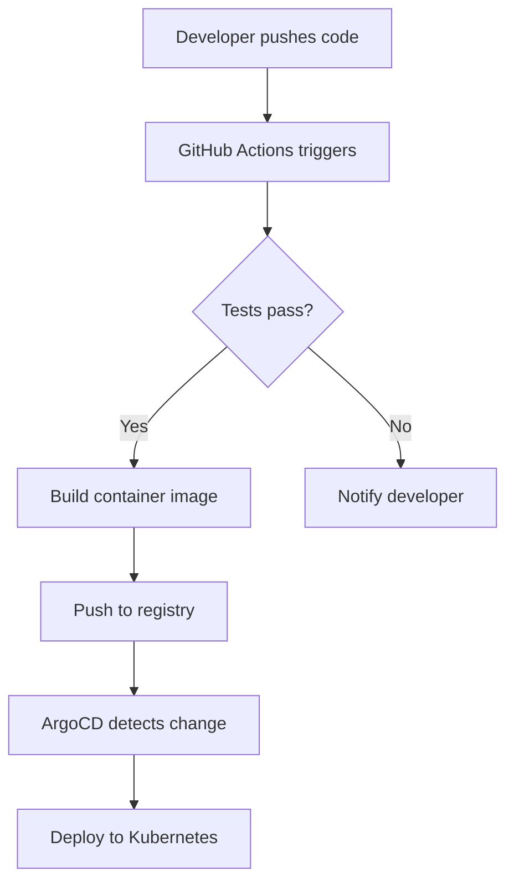

# DEVOPS ENGINEERS — Product Requirements Document (Part 3)

## Content Guidelines, SEO, Certification, Monetization & Roadmap

**Document Version:** 1.0
**Date:** March 2026
**Continues from:** [PRD Part 2](./prd-part-2.md)

---

## Table of Contents

19. [Content Writing Guidelines](#19-content-writing-guidelines)
20. [Video Content Pipeline](#20-video-content-pipeline)
21. [SEO Strategy](#21-seo-strategy)
22. [Certification System](#22-certification-system)
23. [Community Features](#23-community-features)
24. [Monetization Strategy](#24-monetization-strategy)
25. [Launch Strategy & Phases](#25-launch-strategy--phases)
26. [Future Roadmap](#26-future-roadmap)
27. [Success Metrics & KPIs](#27-success-metrics--kpis)
28. [Risk Analysis](#28-risk-analysis)
29. [Appendix: Existing Content Audit](#29-appendix-existing-content-audit)

---

## 19. Content Writing Guidelines

### 19.1 Voice and Tone

The platform's voice is that of an **experienced DevOps architect** who genuinely cares about the learner's success. Think of a senior engineer mentoring a new team member over coffee — knowledgeable, patient, encouraging, and practical.

#### The Golden Rules

| Rule | Do | Don't |
|------|-----|-------|
| **Be human** | "Alright, this next part is genuinely tricky — but once it clicks, you'll wonder why it confused you." | "The following section covers advanced topics." |
| **Tell stories** | "Back in 2013, Docker appeared and changed everything. Let me tell you what happened..." | "Docker is a containerization platform released in 2013." |
| **Celebrate progress** | "You just deployed your first container. Think about that — millions of engineers worldwide rely on this exact workflow." | [No acknowledgment, jump to next topic] |
| **Acknowledge difficulty** | "If this feels overwhelming right now, that's completely normal. Kubernetes has a steep learning curve, and every expert struggled here too." | "This is easy to understand." |
| **Be specific** | "Run this command and you'll see a list of all running containers, their IDs, the image they were created from, and how long they've been running." | "Run this command to see your containers." |
| **Use analogies** | "Think of a Docker image like a recipe and a container like the dish you cook from that recipe. The same recipe can produce many dishes." | "An image is a read-only template with instructions for creating a container." |
| **Address the learner** | "You're going to love this next part." | "The student will learn..." |

#### Writing Formulas

**Introducing a new tool:**
```
1. Tell the origin story (2-3 paragraphs)
2. Describe the problem it solved (1-2 paragraphs)
3. "Let me show you how it works" (transition to hands-on)
```

**Introducing a new concept:**
```
1. Analogy from everyday life (1 paragraph)
2. Technical explanation building on the analogy (1-2 paragraphs)
3. Architecture diagram (1 visual)
4. "Let's see this in action" (hands-on exercise)
```

**Transitioning between topics:**
```
"Now that you understand [previous concept], you might be wondering:
what happens when [natural next question]? That's exactly what
[next topic] is about."
```

### 19.2 Content Structure Standards

#### Lesson Template

Every lesson MUST include these sections in this order:

```markdown
---
[frontmatter — see Section 9.2 of PRD Part 1]
---

# [Lesson Title]

## The Story
[2-4 paragraphs. A narrative that introduces the problem
this lesson solves. Reference real engineering scenarios.
End with a natural transition to the learning content.]

## What You Will Learn
- [Objective 1 — specific and measurable]
- [Objective 2]
- [Objective 3]

## Prerequisites
- [Prerequisite 1 — link to the relevant lesson]
- [Prerequisite 2]

## [Core Concept Section 1]
[Explanation with story-driven approach]

### Architecture
[Diagram explaining how this works under the hood]

### Hands-On Exercise [N]
[Step-by-step with commands and expected output]

### Try It Yourself
[A variation exercise the learner does independently]

## [Core Concept Section 2]
[Same pattern as above]

## What Can Go Wrong
[2-3 common failure scenarios with diagnosis and fixes]

### Debugging Scenario
[A realistic production problem to solve]

## Mini Project: [Project Name]
[A small but meaningful project applying the lesson's concepts]

### Requirements
[What the project must do]

### Hints
[Progressive hints — not the full solution]

### Solution
[Collapsible full solution]

## Quick Quiz
[3-5 questions embedded in the lesson]

## Key Takeaways
- [Takeaway 1]
- [Takeaway 2]
- [Takeaway 3]

## What's Next
[1-2 paragraphs previewing the next lesson and connecting it
to what was just learned]
```

### 19.3 Code Block Standards

#### Format

Every code block must include:

```
Language identifier (bash, python, yaml, json, hcl, dockerfile, etc.)
Filename comment on line 1 (when applicable)
Inline comments explaining non-obvious lines
```

**Good example:**

```bash
# Create a Docker network for our microservices
docker network create \
  --driver bridge \          # Use the default bridge driver
  --subnet 172.20.0.0/16 \  # Define a custom subnet
  my-app-network

# Verify the network was created
docker network ls
```

**Bad example:**

```
docker network create --driver bridge --subnet 172.20.0.0/16 my-app-network
docker network ls
```

#### Expected Output

After every command, show the expected output:

```bash
docker network ls
```

**Expected output:**

```
NETWORK ID     NAME             DRIVER    SCOPE
a1b2c3d4e5f6   bridge           bridge    local
f6e5d4c3b2a1   host             host      local
1a2b3c4d5e6f   my-app-network   bridge    local
9f8e7d6c5b4a   none             null      local
```

### 19.4 Diagram Standards

Architecture diagrams must be:

1. **ASCII art** for simple concepts (renders everywhere):

```
┌──────────┐     HTTP      ┌──────────┐     TCP      ┌──────────┐
│  Client  │ ────────────▶ │  Nginx   │ ────────────▶│  App     │
│          │ ◀──────────── │  (proxy) │ ◀────────────│  Server  │
└──────────┘               └──────────┘              └──────────┘
```

2. **Mermaid diagrams** for complex flows (rendered by the platform):



3. **SVG/PNG images** for detailed architecture (stored in assets/):
   - Kept under 200KB per image
   - Dark mode compatible (no white backgrounds)
   - Alt text always provided

### 19.5 Callout Standards

Use consistent callout components:

```mdx
<Callout type="info" title="Good to Know">
Docker uses Linux namespaces under the hood to isolate containers.
</Callout>

<Callout type="warning" title="Watch Out">
Never use `docker run` with `--privileged` in production unless
you fully understand the security implications.
</Callout>

<Callout type="tip" title="Pro Tip">
Use `docker system prune` periodically to clean up unused images,
containers, and networks. This can free up significant disk space.
</Callout>

<Callout type="danger" title="Critical">
This command deletes all data in the database. Make sure you have
a backup before proceeding.
</Callout>

<Callout type="story" title="Real-World Story">
At a previous company, we had a production outage because someone
ran this exact command without a backup. Here's what happened...
</Callout>
```

### 19.6 Installation Tab Standards

All installation instructions must use tabbed components:

```mdx
<TabGroup>
  <Tab label="Mac">
    ```bash
    brew install docker
    ```
  </Tab>

  <Tab label="Windows">
    Download Docker Desktop from the official website...
  </Tab>

  <Tab label="Linux">
    <TabGroup>
      <Tab label="apt (Ubuntu/Debian)">
        ```bash
        sudo apt update
        sudo apt install docker.io
        ```
      </Tab>

      <Tab label="yum (CentOS/RHEL 7)">
        ```bash
        sudo yum install docker
        ```
      </Tab>

      <Tab label="dnf (Fedora/RHEL 8+)">
        ```bash
        sudo dnf install docker
        ```
      </Tab>
    </TabGroup>
  </Tab>
</TabGroup>
```

### 19.7 Content Quality Checklist

Before any lesson is merged, it must pass this checklist:

- [ ] Starts with a compelling story or narrative
- [ ] Learning objectives are specific and measurable
- [ ] Prerequisites are listed and linked
- [ ] Every concept has at least one hands-on exercise
- [ ] All commands show expected output
- [ ] All code blocks have language identifiers
- [ ] Installation instructions cover Mac, Windows, Linux (apt/yum/dnf)
- [ ] At least 2 troubleshooting scenarios are included
- [ ] A mini project is included
- [ ] 3–5 quiz questions are included with explanations
- [ ] Key takeaways section summarizes the lesson
- [ ] "What's Next" connects to the following lesson
- [ ] No copied content — all explanations are original
- [ ] Writing tone matches platform voice guidelines
- [ ] All links are valid
- [ ] Spell check passes
- [ ] Diagrams render correctly
- [ ] Page loads in under 3 seconds

### 19.8 Content Research Process

When writing a lesson on any technology:

1. **Study the official documentation** — Understand the authoritative explanation
2. **Read 3–5 engineering blog posts** — See how practitioners explain it
3. **Watch 2–3 conference talks or YouTube deep dives** — Understand the narrative
4. **Try every command yourself** — Verify everything works
5. **Write your original explanation** — Synthesize understanding into your own words
6. **Add your production experience** — Include real-world context and war stories
7. **Create original diagrams** — Never copy diagrams from other sources

**Never copy-paste content from any source.** Everything must be rewritten in the platform's voice.

### 19.9 Blog Compatibility

Every lesson should be structured so that it can be extracted and published as a standalone blog post on:

- dev.to
- Medium
- Hashnode
- Personal blogs

To ensure compatibility:
- Lessons must be self-contained (can be understood without reading prior lessons)
- Remove platform-specific components (quizzes, labs) for blog versions
- Add a header linking to the full course on the platform
- MDX components should degrade gracefully to standard Markdown

---

## 20. Video Content Pipeline

### 20.1 Video Strategy

Written lessons are designed to be converted into video walkthroughs in the future. The written content serves as the video script.

### 20.2 Lesson-to-Video Mapping

```
Written Lesson Structure          Video Structure
─────────────────────────         ──────────────────────

The Story                    →    Intro hook (30-60s)
What You Will Learn          →    "In this video..." (15s)
Core Concept                 →    Explanation with slides (3-5 min)
Architecture                 →    Animated diagram (1-2 min)
Hands-On Exercise            →    Screen recording (5-10 min)
What Can Go Wrong            →    "Let me show you what breaks" (2-3 min)
Mini Project                 →    Speed-build timelapse (3-5 min)
Key Takeaways                →    Recap with text overlay (30s)
What's Next                  →    Outro + subscribe CTA (15s)
```

**Target video length:** 15–25 minutes per lesson

### 20.3 Video Production Standards

| Element | Standard |
|---------|----------|
| Resolution | 1920x1080 minimum |
| Audio | Clear narration, no background music during coding |
| Terminal font size | 18px minimum (readable on mobile) |
| Code highlighting | Match platform syntax highlighting |
| Chapters | YouTube chapters for every section |
| Captions | Auto-generated + manually corrected |
| Thumbnail | Consistent template with lesson title |
| Description | Link to written lesson + timestamps |

### 20.4 Video Publishing Pipeline

```
Written lesson is final
       │
       ▼
Create video script from lesson
       │
       ▼
Record screen + narration
       │
       ▼
Edit video (cuts, overlays, diagrams)
       │
       ▼
Add captions and chapters
       │
       ▼
Upload to YouTube
       │
       ▼
Embed in lesson page (optional viewing)
       │
       ▼
Cross-post clips to social media
```

---

## 21. SEO Strategy

### 21.1 SEO Architecture

The platform's content structure is inherently SEO-friendly. Each lesson targets specific keywords that engineers search for.

### 21.2 Keyword Strategy

| Content Type | Keyword Pattern | Example |
|-------------|----------------|---------|
| Origin story | "[tool] history" | "docker history origin story" |
| Tutorial | "how to [action] [tool]" | "how to create docker network" |
| Architecture | "[tool] architecture explained" | "kubernetes architecture explained" |
| Troubleshooting | "[tool] [error] fix" | "kubernetes crashloopbackoff fix" |
| Comparison | "[tool A] vs [tool B]" | "helm vs kustomize" |
| Cheat sheet | "[tool] cheat sheet" | "terraform commands cheat sheet" |
| Project | "build [project] with [tool]" | "build ci/cd pipeline with github actions" |

### 21.3 Technical SEO

| Element | Implementation |
|---------|---------------|
| **URL structure** | Clean, descriptive slugs: `/learn/containerization/docker/networking-basics` |
| **Meta titles** | `[Lesson Title] — DEVOPS ENGINEERS` |
| **Meta descriptions** | Auto-generated from lesson's first paragraph, max 155 characters |
| **Open Graph** | Custom images per learning path, fallback to platform default |
| **Structured data** | Course, Article, HowTo schema markup on lesson pages |
| **Sitemap** | Auto-generated from content directory, submitted to Google |
| **Canonical URLs** | Set on all pages to prevent duplicate content |
| **robots.txt** | Allow all content pages, block API routes and auth pages |
| **Performance** | Core Web Vitals optimized (see Performance Targets in PRD Part 2) |
| **Mobile-first** | All pages responsive and mobile-friendly |

### 21.4 Content SEO

Each lesson page includes:

```html
<!-- Example: Docker Networking lesson -->

<title>Docker Networking — How Containers Communicate | DEVOPS ENGINEERS</title>

<meta name="description" content="Learn how Docker containers communicate
using bridge networks, host networking, and overlay networks. Hands-on
exercises with real commands and troubleshooting scenarios.">

<script type="application/ld+json">
{
  "@context": "https://schema.org",
  "@type": "Course",
  "name": "Docker — From Zero to Production",
  "description": "Complete Docker course with hands-on labs",
  "provider": {
    "@type": "Organization",
    "name": "DEVOPS ENGINEERS"
  },
  "hasCourseInstance": {
    "@type": "CourseInstance",
    "courseMode": "online",
    "courseWorkload": "PT60H"
  }
}
</script>
```

### 21.5 Internal Linking Strategy

Every lesson links to:
- **Prerequisites** — "Before this lesson, make sure you've completed [link]"
- **Related concepts** — "This works similarly to [link] which we covered earlier"
- **Deeper dives** — "Want to go deeper? See our [link] lesson"
- **Cross-technology connections** — "When we get to Kubernetes, you'll see how this Docker concept translates to [link]"

Target: Every lesson should have **5+ internal links** to other lessons.

### 21.6 External Content Strategy

Repurpose platform content on external channels:

| Channel | Content Type | Frequency | Link Back |
|---------|-------------|-----------|-----------|
| dev.to | Full lessons (adapted) | 2/week | Link to platform for labs/quizzes |
| Medium | Architecture deep dives | 1/week | Link to full learning path |
| YouTube | Video walkthroughs | 2/week | Description links to platform |
| Twitter/X | Quick tips, diagrams | Daily | Link to relevant lesson |
| LinkedIn | Career-focused articles | 2/week | Link to platform |
| Reddit | Helpful answers in r/devops, r/kubernetes | Ongoing | Natural mentions |
| GitHub | Lab repositories, cheat sheets | Monthly | README links to platform |

---

## 22. Certification System

### 22.1 Certificate Levels

| Level | Scope | Requirements |
|-------|-------|-------------|
| **Module Certificate** | Single module (e.g., "Docker Fundamentals") | Complete all lessons, pass module assessment (80%+), submit mini projects |
| **Path Certificate** | Full learning path (e.g., "Containerization & Orchestration") | Complete all modules, pass path assessment (80%+), submit capstone project |
| **Platform Certificate** | Entire platform ("DEVOPS ENGINEERS Certified") | Complete all 6 paths, pass comprehensive assessment (85%+), submit mega project |

### 22.2 Certificate Design

```
╔═══════════════════════════════════════════════════════════╗
║                                                           ║
║                    DEVOPS ENGINEERS                        ║
║                                                           ║
║              Certificate of Completion                     ║
║                                                           ║
║    This certifies that                                     ║
║                                                           ║
║              [LEARNER NAME]                                ║
║                                                           ║
║    has successfully completed                              ║
║                                                           ║
║    Containerization & Orchestration                         ║
║    Learning Path                                           ║
║                                                           ║
║    Including: Docker, Kubernetes, Helm, Kustomize          ║
║                                                           ║
║    Lessons: 150+  |  Projects: 8  |  Labs: 120+           ║
║                                                           ║
║    Date: March 15, 2026                                    ║
║    Verification: devops-engineers.com/verify/ABC123        ║
║                                                           ║
╚═══════════════════════════════════════════════════════════╝
```

### 22.3 Certificate Verification

Each certificate has:

- **Unique verification code** — 8-character alphanumeric
- **Public verification URL** — `devops-engineers.com/certificates/{code}`
- **QR code** — Scannable link to verification page
- **LinkedIn compatibility** — Shareable as a LinkedIn certification
- **PDF download** — High-resolution printable version
- **JSON-LD metadata** — Machine-readable credential data

### 22.4 Verification Page

When someone visits a certificate verification URL:

```
┌──────────────────────────────────────────┐
│                                          │
│  ✓ VERIFIED CERTIFICATE                  │
│                                          │
│  Name:    Priya Sharma                   │
│  Path:    Containerization & Orchestration│
│  Issued:  March 15, 2026                 │
│  Code:    ABC12345                        │
│                                          │
│  This learner completed:                 │
│  • 150+ lessons                          │
│  • 120+ hands-on labs                    │
│  • 8 projects                            │
│  • 2 assessments (90% average)           │
│  • 250+ hours of learning               │
│                                          │
│  Skills validated:                       │
│  Docker, Kubernetes, Helm, Kustomize,    │
│  Container networking, Pod scheduling,   │
│  Helm chart development, ...             │
│                                          │
└──────────────────────────────────────────┘
```

### 22.5 Anti-Cheating Measures

| Measure | Implementation |
|---------|---------------|
| **Randomized quiz pools** | Questions drawn randomly from large pools |
| **Time tracking** | Minimum time per lesson (no speed-clicking through) |
| **Exercise validation** | Labs require actual commands to be executed |
| **Assessment proctoring** | Final assessments have time limits and cannot be retaken within 24 hours |
| **Project review** | Capstone projects require a brief write-up explaining the architecture |

---

## 23. Community Features

### 23.1 Community Architecture

Community is built progressively — start simple, add features as the community grows:

**Phase 1 (Launch):**
- GitHub Discussions for Q&A per module
- Discord server for real-time chat

**Phase 2 (1,000+ users):**
- In-platform discussion threads per lesson
- Study groups
- Learner profiles with public progress

**Phase 3 (10,000+ users):**
- Mentorship matching
- Project collaboration
- Community-contributed content
- Localization / translation program

### 23.2 Discussion Integration

Each lesson has a discussion section at the bottom:

```
┌──────────────────────────────────────────┐
│  Discussion (12 comments)                │
│                                          │
│  ┌────────────────────────────────────┐  │
│  │ Ahmed asked 2 hours ago:           │  │
│  │ "What happens if two containers    │  │
│  │  have the same name on a network?" │  │
│  │                                    │  │
│  │ ▸ 3 replies                        │  │
│  └────────────────────────────────────┘  │
│                                          │
│  ┌────────────────────────────────────┐  │
│  │ Sofia shared 1 day ago:            │  │
│  │ "I solved the mini project with    │  │
│  │  a different approach using..."    │  │
│  │                                    │  │
│  │ ▸ 5 replies  ♥ 8 likes             │  │
│  └────────────────────────────────────┘  │
│                                          │
│  [Ask a question or share your solution] │
│                                          │
└──────────────────────────────────────────┘
```

### 23.3 Leaderboard

A friendly, opt-in leaderboard to motivate learners:

| Rank | Learner | Level | XP | Streak | Paths |
|------|---------|-------|-----|--------|-------|
| 1 | @priya-dev | 8 — Staff Engineer | 42,350 | 67 days | 4/6 |
| 2 | @marcus-ops | 7 — Senior Engineer | 38,200 | 45 days | 3/6 |
| 3 | @sofia-cloud | 7 — Senior Engineer | 35,800 | 120 days | 3/6 |

**Filters:** Global, This Week, This Month, By Path, By Country

---

## 24. Monetization Strategy

### 24.1 Core Philosophy

**All learning content is free and open-source.** The platform generates revenue through premium features that enhance the experience but are never required to learn.

### 24.2 Free Tier (Always Free)

| Feature | Included |
|---------|----------|
| All 500+ lessons | Yes |
| All hands-on exercises | Yes |
| Local Docker labs | Yes |
| Quizzes | Yes |
| Progress tracking | Yes |
| Community access | Yes |
| Mini projects | Yes |
| Cheat sheets and references | Yes |

### 24.3 Premium Tier ($9/month or $79/year)

| Feature | Description |
|---------|-------------|
| **Cloud labs** | Browser-based terminal and Codespaces access |
| **Certificates** | Module, path, and platform certificates |
| **Advanced assessments** | Timed assessments with proctoring |
| **Priority support** | Fast responses in community channels |
| **Early access** | New content 2 weeks before public release |
| **Ad-free experience** | No promotional banners |
| **Offline access** | Download lessons as PDF |
| **Custom learning plans** | AI-generated personalized study schedules |

### 24.4 Team Tier ($29/user/month)

| Feature | Description |
|---------|-------------|
| Everything in Premium | All premium features |
| **Team dashboard** | Manager view of team progress |
| **Custom learning paths** | Create paths tailored to team needs |
| **SSO integration** | SAML/OIDC authentication |
| **Reporting** | Detailed analytics and progress reports |
| **Dedicated support** | Slack channel with platform team |
| **Custom certificates** | Company-branded certificates |

### 24.5 Revenue Projections (Conservative)

| Year | Free Users | Premium | Team | Monthly Revenue |
|------|-----------|---------|------|----------------|
| Year 1 | 50,000 | 500 | 50 | $5,950 |
| Year 2 | 200,000 | 3,000 | 200 | $32,800 |
| Year 3 | 500,000 | 10,000 | 500 | $104,500 |
| Year 4 | 1,000,000 | 25,000 | 1,000 | $254,000 |

### 24.6 Additional Revenue Streams

| Stream | Description | Timeline |
|--------|-------------|----------|
| **Sponsorships** | Tool companies sponsor relevant modules | Year 1+ |
| **Job board** | Connect learners with employers | Year 2+ |
| **Corporate training** | Custom training engagements | Year 2+ |
| **Merchandise** | Platform-branded swag | Year 1+ |
| **Donations** | GitHub Sponsors, Open Collective | Day 1 |

---

## 25. Launch Strategy & Phases

### 25.1 Phase 1 — Foundation (Months 1–3)

**Goal:** Build the platform skeleton and first complete learning path.

| Milestone | Deliverable |
|-----------|-------------|
| Week 1–2 | Repository setup, Next.js app scaffold, CI/CD pipeline |
| Week 3–4 | Clerk auth, Supabase database, basic user profiles |
| Week 5–8 | MDX content engine, lesson page layout, code blocks, tabs |
| Week 9–10 | Progress tracking, XP system, dashboard (basic) |
| Week 11–12 | **Foundations Path — Linux module** (30+ lessons, hands-on labs) |

**Launch milestone:** Platform is live with Linux Fundamentals module. Users can sign up, learn, and track progress.

### 25.2 Phase 2 — Core Content (Months 4–6)

**Goal:** Complete the Foundations path and start Containerization.

| Milestone | Deliverable |
|-----------|-------------|
| Month 4 | Shell Scripting module + Git module |
| Month 5 | Networking module + Python Automation module |
| Month 5 | Quiz engine + certificate generation |
| Month 6 | Docker Fundamentals module (start of Path 2) |
| Month 6 | Local Docker labs for all modules |

**Launch milestone:** Complete Foundations path available. First certificates issued.

### 25.3 Phase 3 — Expansion (Months 7–9)

**Goal:** Complete Containerization path and start CI/CD.

| Milestone | Deliverable |
|-----------|-------------|
| Month 7 | Docker Advanced + Kubernetes Fundamentals |
| Month 8 | Kubernetes Advanced + Helm + Kustomize |
| Month 8 | Browser-based terminal labs |
| Month 9 | GitHub Actions + Jenkins modules |
| Month 9 | Community features (discussions, leaderboard) |

**Launch milestone:** Two complete learning paths. Browser labs operational.

### 25.4 Phase 4 — Full Platform (Months 10–14)

**Goal:** Complete all 6 learning paths.

| Milestone | Deliverable |
|-----------|-------------|
| Month 10 | ArgoCD + Flux modules |
| Month 11 | Terraform + AWS modules |
| Month 12 | Ansible module + Observability path (Prometheus, Grafana) |
| Month 13 | OpenTelemetry + SRE modules |
| Month 14 | Platform Engineering path + mega projects |

**Launch milestone:** All 6 learning paths complete. Platform certificate available.

### 25.5 Phase 5 — Scale (Months 15+)

**Goal:** Scale to 100,000+ learners and optimize.

| Milestone | Deliverable |
|-----------|-------------|
| Ongoing | Video content production |
| Ongoing | Community growth and moderation |
| Ongoing | Content updates and improvements |
| Ongoing | Premium and team tier features |
| Ongoing | Mobile app exploration |
| Ongoing | Localization (Spanish, Hindi, Portuguese, etc.) |

---

## 26. Future Roadmap

### 26.1 Near-term (6–12 months post-launch)

| Feature | Priority | Description |
|---------|----------|-------------|
| **Video walkthroughs** | High | Video versions of all written lessons |
| **Mobile app** | Medium | React Native app for reading lessons on the go |
| **AI tutor** | High | AI-powered assistant that answers questions using platform content |
| **Interactive diagrams** | Medium | Clickable, explorable architecture diagrams |
| **Pair programming labs** | Low | Two learners solve a problem together in a shared terminal |

### 26.2 Medium-term (12–24 months post-launch)

| Feature | Priority | Description |
|---------|----------|-------------|
| **Additional clouds** | High | Azure and GCP learning paths |
| **Advanced certifications** | Medium | Specialized certifications (e.g., "Kubernetes Expert") |
| **Bootcamp mode** | High | Structured 12-week intensive program with deadlines |
| **Employer partnerships** | Medium | Companies sponsor learners and hire graduates |
| **Localization** | High | Spanish, Hindi, Portuguese, French, Japanese |
| **Accessibility audit** | High | WCAG 2.1 AA compliance |

### 26.3 Long-term (24+ months post-launch)

| Feature | Priority | Description |
|---------|----------|-------------|
| **Live workshops** | Medium | Scheduled live coding sessions with instructors |
| **Capture the Flag** | High | Security-focused CTF challenges |
| **Chaos engineering labs** | Medium | Break things in a safe environment |
| **Enterprise LMS** | Medium | White-label version for companies |
| **University partnerships** | Low | Credit-bearing courses with universities |
| **Mentorship marketplace** | Medium | Connect learners with experienced engineers |

---

## 27. Success Metrics & KPIs

### 27.1 Growth Metrics

| Metric | Year 1 Target | Year 2 Target | Year 3 Target |
|--------|--------------|--------------|--------------|
| Total registered users | 50,000 | 200,000 | 500,000 |
| Monthly active users | 10,000 | 50,000 | 150,000 |
| Daily active users | 2,000 | 10,000 | 30,000 |
| GitHub stars | 5,000 | 20,000 | 50,000 |
| Community members | 5,000 | 25,000 | 75,000 |

### 27.2 Engagement Metrics

| Metric | Target |
|--------|--------|
| Lesson completion rate | > 60% |
| Module completion rate | > 40% |
| Path completion rate | > 20% |
| Average session duration | > 25 minutes |
| 7-day retention | > 50% |
| 30-day retention | > 30% |
| Quiz pass rate (first attempt) | > 65% |
| Lab completion rate | > 55% |

### 27.3 Content Metrics

| Metric | Target |
|--------|--------|
| Lessons published | 500+ by end of Year 1 |
| Community contributions | 100+ merged PRs by end of Year 1 |
| Content freshness | No lesson older than 6 months without review |
| Broken link rate | < 0.1% |
| Average content rating | > 4.5/5 |

### 27.4 Business Metrics

| Metric | Year 1 Target | Year 2 Target |
|--------|--------------|--------------|
| Premium conversion rate | 1–2% | 2–3% |
| Team tier customers | 50 | 200 |
| Monthly recurring revenue | $5,000 | $30,000 |
| Cost per active user | < $0.05 | < $0.03 |
| Certificates issued | 2,000 | 15,000 |

### 27.5 Impact Metrics

| Metric | Target |
|--------|--------|
| Learners who got their first DevOps job | Track via surveys |
| Learners who got a promotion | Track via surveys |
| Average salary increase | Track via surveys |
| Learner satisfaction score | > 4.5/5 |
| Net Promoter Score (NPS) | > 60 |

---

## 28. Risk Analysis

### 28.1 Technical Risks

| Risk | Probability | Impact | Mitigation |
|------|------------|--------|------------|
| Supabase free tier limits exceeded before revenue | Medium | High | Monitor usage, have migration plan to self-hosted PostgreSQL |
| Content rendering performance with 500+ MDX pages | Low | Medium | Static generation, incremental builds, caching |
| Lab infrastructure costs at scale | High | High | Prioritize local Docker labs, limit cloud labs to premium |
| Content piracy / scraping | Medium | Low | Content is open-source anyway; premium value is in platform features |
| Security breach exposing user data | Low | Critical | RLS policies, regular security audits, minimal data collection |

### 28.2 Content Risks

| Risk | Probability | Impact | Mitigation |
|------|------------|--------|------------|
| Content becomes outdated rapidly | High | High | Quarterly review cycles, community contribution model |
| Inconsistent quality across modules | Medium | High | Strict content checklist, editorial review process |
| Writer burnout (small team, massive scope) | High | High | Prioritize P0 technologies, accept community help early |
| Copyright issues with referenced material | Low | Medium | Original content only, proper attribution for inspiration |

### 28.3 Business Risks

| Risk | Probability | Impact | Mitigation |
|------|------------|--------|------------|
| Low premium conversion rate | Medium | High | Ensure premium features provide genuine value, not artificial scarcity |
| Competitor launches similar platform | Medium | Medium | Move fast, build community moat, stay open-source |
| Community toxicity | Medium | Medium | Code of conduct, active moderation, community guidelines from day 1 |
| Scope creep delaying launch | High | High | Launch with Foundations path only, iterate based on feedback |

---

## 29. Appendix: Existing Content Audit

### 29.1 Current Repository State

The repository already contains **31,576 lines** of content across **10 files** covering Git and Linux/Shell Scripting:

| File | Location | Lines | Coverage |
|------|----------|-------|----------|
| git-course-overview.md | Git/ | 82 | Master course outline (8 parts) |
| git.md | Git/ | 5,444 | Comprehensive Git manual (Parts 1–3) |
| git_fundamentals_day_1.md | Git/ | 502 | Hands-on fundamentals (Exercises 1–10) |
| github_remote_repo_day_2.md | Git/ | 1,266 | Remote repositories (Exercises 11–16) |
| advanced_git_operations_day_3.md | Git/ | 1,587 | Rebase, cherry-pick, bisect |
| enterprise_branching_day_4.md | Git/ | 1,554 | GitFlow, GitHub Flow, GitLab Flow |
| linux_administration.md | Linux-Shell_Scripting/ | 2,812 | 17-chapter administration guide |
| linux-administration-handson.md | Linux-Shell_Scripting/ | 5,608 | Hands-on administration (Chapters 1–4) |
| linux-mastering-handson.md | Linux-Shell_Scripting/ | 5,238 | Zero-to-hero Linux mastery |
| shell-scripting-handson.md | Linux-Shell_Scripting/ | 7,483 | Complete shell scripting (Part 1+) |

### 29.2 Alignment with New Platform Structure

The existing content is strong and can be **migrated** into the new platform structure:

| Existing Content | New Platform Location | Migration Effort |
|-----------------|----------------------|-----------------|
| Git files (6 total) | `content/paths/foundations/git/` | Medium — restructure into lesson format, add MDX frontmatter |
| Linux admin files (3 total) | `content/paths/foundations/linux/` | Medium — split into individual lessons, add exercises per lesson |
| Shell scripting (1 file) | `content/paths/foundations/shell-scripting/` | Medium — split into modules, add quizzes and mini projects |

### 29.3 Content Gaps (to be created)

| Technology | Status | Priority |
|-----------|--------|----------|
| Linux | **Partially exists** — Needs restructuring and expansion | P0 |
| Shell Scripting | **Partially exists** — Needs restructuring and expansion | P0 |
| Git | **Partially exists** — Needs restructuring and expansion | P0 |
| Python Automation | Not started | P0 |
| Networking | Not started | P0 |
| Docker | Not started | P0 |
| Kubernetes | Not started | P0 |
| Helm | Not started | P1 |
| Kustomize | Not started | P1 |
| GitHub Actions | Not started | P0 |
| Jenkins | Not started | P1 |
| ArgoCD | Not started | P0 |
| Flux | Not started | P2 |
| Terraform | Not started | P0 |
| AWS | Not started | P0 |
| Ansible | Not started | P1 |
| Prometheus | Not started | P0 |
| Grafana | Not started | P0 |
| OpenTelemetry | Not started | P1 |
| SRE | Not started | P0 |
| Distributed Systems | Not started | P1 |
| Platform Engineering | Not started | P2 |

### 29.4 Writing Style Assessment

The existing content already follows many of the platform's writing principles:

| Principle | Current Status | Notes |
|-----------|---------------|-------|
| Story-driven | Partially | Git origin stories are strong; Linux could use more narrative |
| Hands-on exercises | Strong | 150+ exercises exist with step-by-step instructions |
| Analogies and metaphors | Strong | Pizza restaurant (Linux), time machine (Git), car brands |
| Encouraging tone | Good | Career progression and salary context provided |
| Architecture explanations | Good | ASCII diagrams and component breakdowns present |
| Troubleshooting scenarios | Needs improvement | Limited troubleshooting content in existing material |
| Mini projects | Needs improvement | Exercises exist but structured mini projects are missing |
| Quiz integration | Missing | No quizzes in existing content |

---

## Summary

The DEVOPS ENGINEERS platform is designed to:

1. **Teach** 1 million people through story-driven, hands-on learning
2. **Cover** 20+ technologies from zero to production expert
3. **Provide** 500+ lessons, 1000+ labs, 500+ mini projects
4. **Operate** affordably using open-source tools and free tiers
5. **Scale** from $0/month to sustainable revenue
6. **Build** a global community of DevOps engineers helping each other grow

The existing content provides a solid starting point. The PRD defines every aspect needed to transform this repository into a world-class learning platform.

**Next step:** Begin Phase 1 — build the Next.js application scaffold, set up the content engine, and migrate existing Git and Linux content into the new lesson format.

---

*DEVOPS ENGINEERS — Training 1 Million Engineers, One Story at a Time.*
